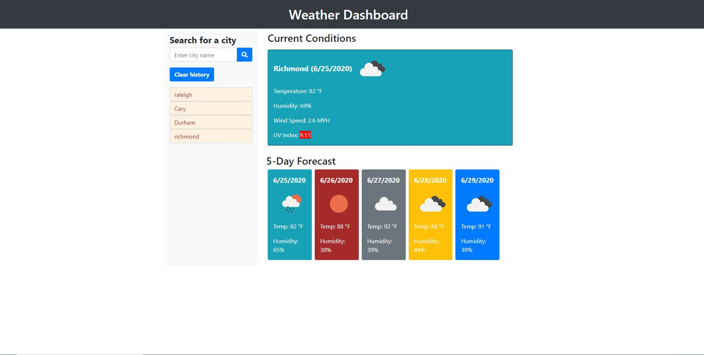

# weatherDashboard

## Purpose

Create a Javascript and AJAX  powered Weather Dashboard application that can help the traveling user with looking up the weather outlook for multiple cities. This app will run in the browser and feature dynamically updated HTML and CSS powered by Javascript code. It will also feature a clean and polished user interface and be responsive, ensuring that it adapts to multiple screen sizes.

## Design

The weatherDashboard has a single html page namely index.html. It has a static style sheet files viz., styles.css. It has a javascript file called script.js which mainly has javascript and AJAX libary code.

The html page is designed using bootstrap components so page is responsive to screen size changes and work well on all viewport sizes and devices. The pages are validated using java and js validation services and is free of errors and warnings.

The script.js adds the dynamic behavior to the respective page. The script.js is the main crux of the app. It takes city name as input from the user. It dynamically makes appropriate AJAX API calls to https://openweathermap.org/api,  to obtain current weather conditions, current UV index and 5 day forecast data for the particular city. The obtained response is appropriately displayed for the user. The UV index information is color coded based on the received uvi value and the grading levels. Appropriate weather icons are displayed for graphically representing the current and forecasted weather conditions. The input city name is stored in localStorage as well as in searchHistory section of the page. At any time, the user can select a city from searchHistory section and view the weather information for that city. There is a clear button which can clear the searchHistory data ( at both localStorage and webpage)

The highlight of the app is:

1. It provides weather conditions by querying www.openweathermap.org. 
2. For retrieving the current conditions it uses https://api.openweathermap.org/data/2.5/weather?q={cityName}"&appid="{APIKey};
3. For Current weather conditions it displays city name, the date, current temperature, current weather icon to represent current weather conditions, humidity, windspeed and color coded uv index.
4. The uv-index value is not obtained from the above api mentioned in step 2. It is obtained using a different api which is supposed to be one call API. The api used is "https://api.openweathermap.org/data/2.5/onecall?lat={lat}&lon={lon}&exclude=current,minutely,hourly&appid={APIKey}
5. Before rendering obtained uv-index value, appropriate color coding is rendered.
6. The 5 day weather forecast displays 5 day forecast starting from current day. The date, weather icon representing forecasted weather conditions, forecasted max temperature and forecasted humidity are displayed.

### The code repository for this work can be found at:

[repository](https://github.com/s-suresh-kumar/weatherDashboard)

### The hosted web page for this work can be found at:

[Deployed Application](https://s-suresh-kumar.github.io/weatherDashboard/)

## Usage

Click on [Deployed Application](https://s-suresh-kumar.github.io/weatherDashboard/) to launch Javascript powered weatherDashboard app. Provide the city name for which current and 5 day forecast weather info is needed. If the app makes apprpriate API call to openweathermap site and the results are displayed.

